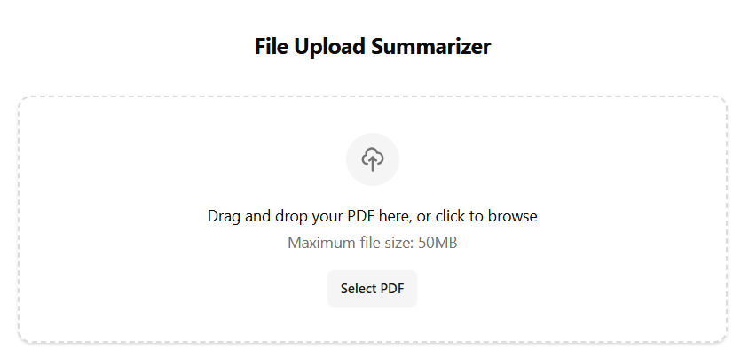
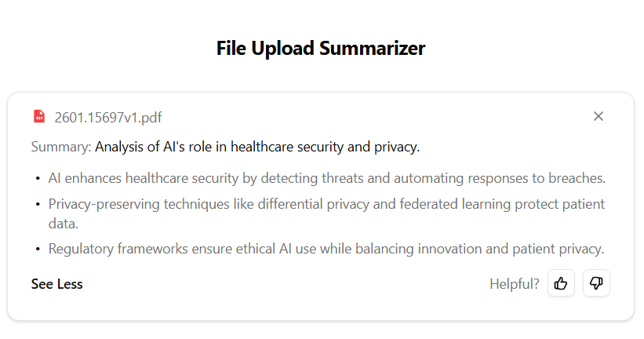

# PDF Summarizer

A web app that extracts text from uploaded PDFs and generates concise AI-powered summaries using OpenAI's GPT-4o-mini. Built with Next.js 14, shadcn/ui, and Tailwind CSS.


## Screenshots

| Upload | Summary |
|--------|---------|
|  |  |

## Features

- **Drag-and-drop upload** — drop a PDF or click to browse
- **Smart summaries** — 8-word headline summary with 3 expandable bullet points
- **Feedback collection** — thumbs up/down with optional comments
- **Error handling** — clear, user-friendly messages for corrupt files, image-only PDFs, API failures, and more
- **Editable prompts** — summary generation prompts live in a single file for easy tuning

## Tech Stack

| Layer | Technology |
|-------|-----------|
| Framework | [Next.js 14](https://nextjs.org/) (App Router) |
| Language | TypeScript (strict mode) |
| UI | [shadcn/ui](https://ui.shadcn.com/) + Tailwind CSS |
| AI | [OpenAI API](https://platform.openai.com/) (GPT-4o-mini) |
| PDF Parsing | [pdf-parse](https://www.npmjs.com/package/pdf-parse) |

## Getting Started

### Prerequisites

- Node.js 18+
- An [OpenAI API key](https://platform.openai.com/api-keys)

### Setup

```bash
# Clone the repository
git clone https://github.com/YOUR_USERNAME/pdf-summarizer.git
cd pdf-summarizer

# Install dependencies
npm install

# Configure environment
cp .env.local.example .env.local
# Edit .env.local and add your OpenAI API key

# Start the dev server
npm run dev
```

Open [http://localhost:3000](http://localhost:3000) to use the app.

## Project Structure

```
app/
├── page.tsx                 # Main page — orchestrates upload → summarize → feedback flow
├── api/
│   ├── upload/route.ts      # PDF upload & text extraction endpoint
│   └── summarize/route.ts   # OpenAI summarization endpoint
components/
├── pdf-uploader.tsx         # Drag-and-drop file upload zone
├── summary-card.tsx         # Summary display with expand/collapse
├── feedback-widget.tsx      # Thumbs up/down + optional comments
├── ui/                      # shadcn/ui base components
lib/
├── openai.ts                # OpenAI client config (model, timeouts, retries)
├── pdf-parser.ts            # PDF text extraction with error detection
├── utils.ts                 # Tailwind class merging utility
prompts/
└── summarize.ts             # All AI prompts — edit here to tune output
```

## How It Works

1. **Upload** — The user drops a PDF onto the upload zone. The client validates file type and size (50 MB max), then sends it to `/api/upload`.
2. **Extract** — The server extracts text using `pdf-parse`. If the PDF is corrupt, password-protected, or image-only, a descriptive error is returned.
3. **Summarize** — Extracted text is sent to `/api/summarize`, which calls GPT-4o-mini with structured prompts to generate an 8-word headline and 3 bullet points.
4. **Feedback** — The user can rate the summary (thumbs up/down) and leave an optional comment.

### Customizing Prompts

All prompts live in [`prompts/summarize.ts`](prompts/summarize.ts). Edit the `shortSummary` and `expandedSummary` templates to change how summaries are generated — no code changes needed elsewhere.

## Limitations

- Text-based PDFs only (no OCR for scanned documents)
- Single PDF at a time (no batch processing)
- Summaries and feedback are in-memory only (not persisted)
- No authentication

## License

[MIT](LICENSE)
